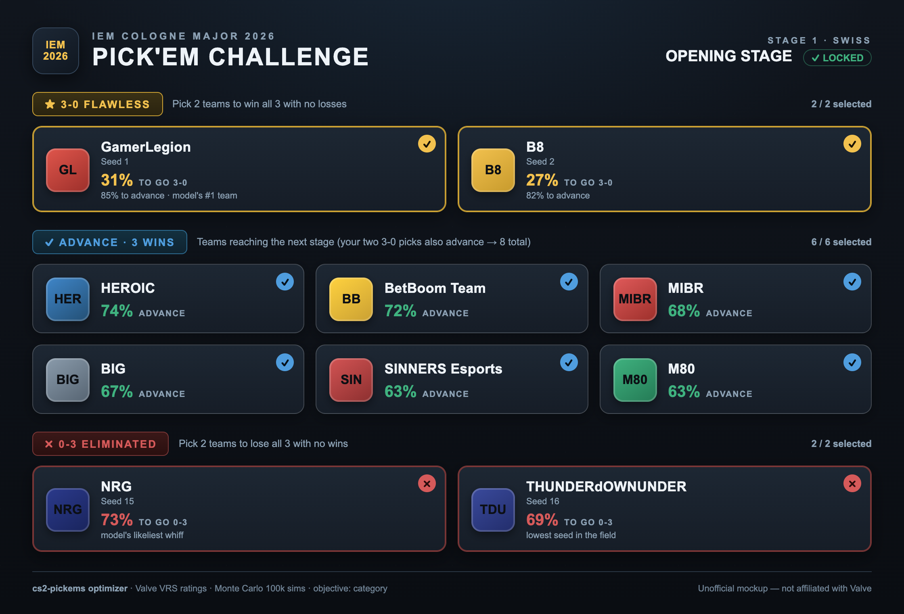
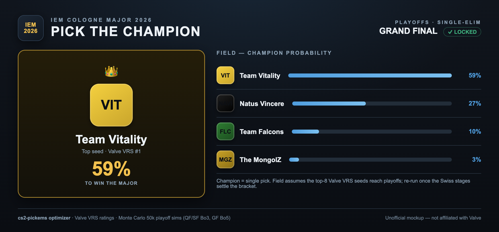
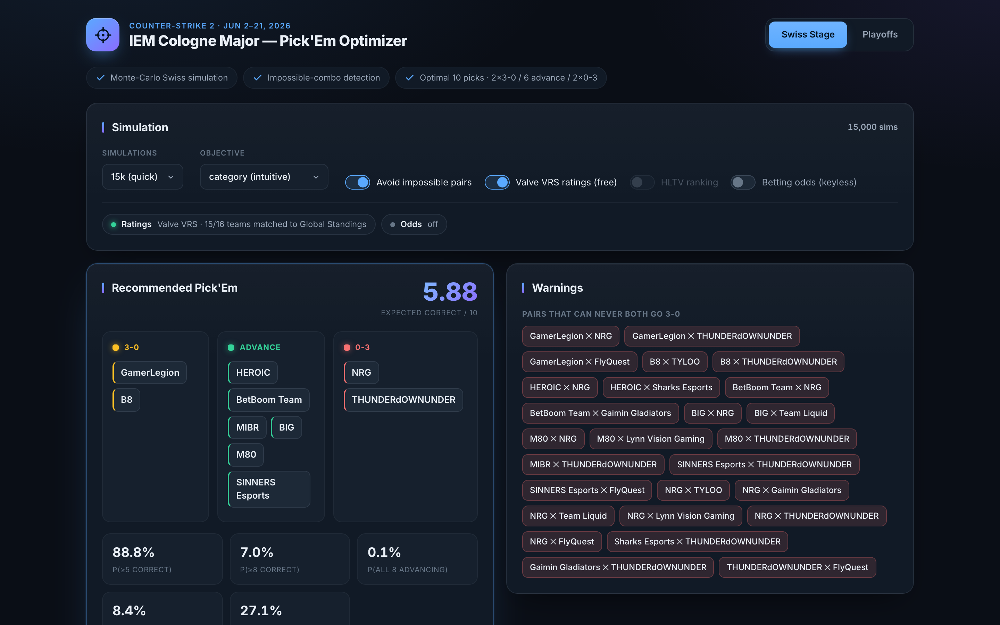
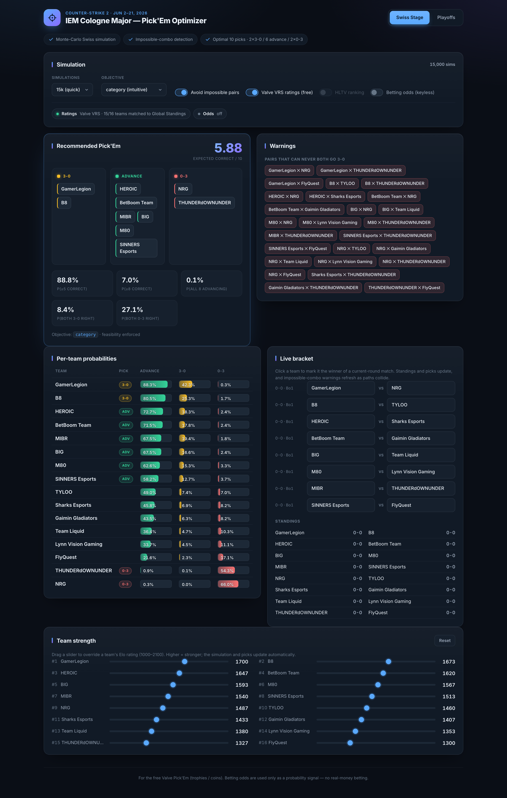
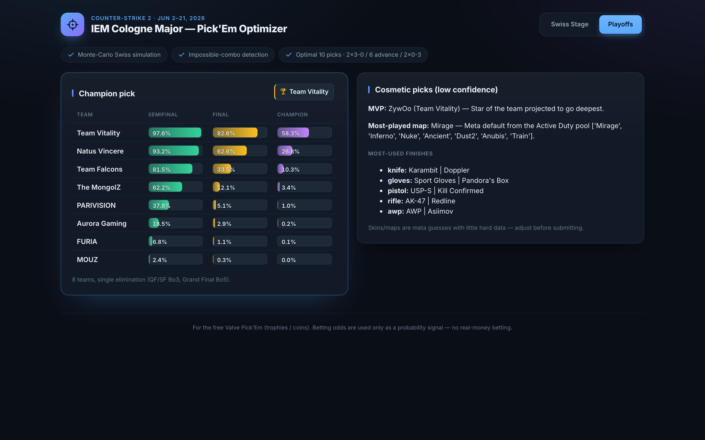

# CS2 IEM Cologne Major 2026 — Pick'Em Optimizer

A data-driven engine for mastering the **IEM Cologne Major 2026** Pick'Em Challenge (June 2026).

The optimizer fuses the market's collective wisdom — the win probabilities implied by live
**betting odds** — with the official **HLTV** and **Valve** world rankings to build a nuanced
picture of each team's true strength. From there it runs a full **Monte Carlo** simulation of
every Swiss stage, faithfully reproducing Valve's real **Buchholz** pairing rules, and weighs
the entire spread of plausible outcomes to settle on the most rewarding set of predictions for
each stage. Just as importantly, it exposes the hidden contradictions that quietly sink most
entries — tempting picks that are in fact mutually impossible, such as two contenders whose
paths must cross before either can complete a flawless run. Coverage extends beyond the group
stage to the playoff bracket and the cosmetic picks, all delivered through a clean, interactive
web app.

## The Picks
**Stage 1** 
IEM Cologne 2026 (Valve VRS ratings + live keyless odds, 100k Monte Carlo sims):



And the playoff **champion** pick:



> Generated mockups styled after the in-game screen (not affiliated with Valve).
> Team seeds are provisional — re-run before the stage locks. Regenerate by opening
> [`docs/pickem_mockup.html`](docs/pickem_mockup.html) in a browser and screenshotting.

## The live web app

Those are stills from the in-client-style mockup. Below is the **actual web UI**
(FastAPI + React), driven end to end by the same optimizer:



The full **Swiss Stage** view — recommendation, per-team probabilities, the live bracket, and Elo sliders:



The **Playoffs** tab — champion odds and cosmetic picks:



## Tournament format (researched)

- 32 teams, **cascading 16-team Swiss stages**: Stage 1 → top 8 join Stage 2 invites →
  top 8 join Stage 3 invites → top 8 reach the 8-team single-elim playoffs (Bo3, GF Bo5).
- Inside a Swiss stage: advancement/elimination matches are **Bo3**, others **Bo1**
  (Stage 3 is all Bo3). Seeding = Valve Global Standings.
- Pick'Em per Swiss stage: pick **2 teams → 3-0**, **2 → 0-3**, **6 → advance**, plus
  cosmetic skin/map/MVP picks. A 3-0 pick scores nothing if the team goes 3-1.

## How the impossible-combo detection works

The Monte Carlo runs keep the **joint outcome of every simulation**, so for any two
teams we know P(both finish 3-0). When that is 0 — because their paths must collide
(they meet in the match that decides a 3-0 spot) — the pair is flagged *impossible* and
the optimizer refuses to put both in the 3-0 slot. This updates live as results come in:

```
[IMPOSSIBLE] GamerLegion and BetBoom Team can never BOTH finish 3-0 — they play each
other right now in the 2-0 match. At most one of your two 3-0 picks can hit.
```

## Architecture

- `backend/` — Python (FastAPI) data ingestion + simulation + optimization engine.
- `frontend/` — Vite + React + TS interactive UI (override team strength, see picks live).
- `data/` — cached snapshots (gitignored).

Engine pipeline: odds/rankings → `ratings` (pairwise map probs) → `swiss` (Buchholz
pairing) → `simulate` (Monte Carlo marginals + joint samples) → `optimizer` (best 10
picks) + `feasibility` (warnings); plus `playoffs` and `cosmetics`.

## Run it

**1. Backend (API on :8000)**
```bash
cd backend
uv sync --extra dev
uv run uvicorn app.main:app --reload
```

**2. Frontend (UI on :5173)**
```bash
cd frontend
npm install
npm run dev          # open http://localhost:5173
```

**Terminal report (no UI):**
```bash
cd backend
uv run python -m app.cli --stage 1 --sims 50000          # offline (seed-prior ratings)
uv run python -m app.cli --stage 1 --use-odds --use-hltv # live odds + HLTV ratings
```

**Tests / lint:**
```bash
cd backend && uv run pytest -q && uv run ruff check .
```

## Data sources & keys

All sources degrade gracefully — the app works offline on a transparent seed-based
rating prior. **No API key is required** to use real strength data:

- **Valve VRS (recommended, free, no key):** the official Global Standings that seed the
  Major, pulled from Valve's public GitHub repo and rescaled to ratings. Enabled by the
  "Valve VRS ratings" toggle (on by default) or `--use-valve`. Source:
  `app/data/valve_standings.py`.
- **HLTV ranking** — scraped best-effort (Cloudflare-protected; cached, rate-limited);
  `--use-hltv`. Note: Valve VRS has priority, so HLTV only takes effect when Valve is off.
- **Betting odds (keyless, default):** Bovada's public coupon JSON — **no API key, no
  signup**. De-vigged match odds override per-matchup win probabilities (`--use-odds`,
  or the "use betting odds" toggle). Used purely as a probability signal — no real-money
  betting. Optional keyed alternative: set `ODDS_API_KEY` and `ODDS_PROVIDER=oddspapi`.
- **Liquipedia** (MediaWiki API) provides teams/seeding/results.

Ratings priority when multiple are enabled: **Valve VRS → HLTV → seed prior**. The
`/analyze` response reports the source it actually used under `data_sources`, and the UI
shows it (e.g. "Ratings: Valve VRS — 15/16 matched · Odds: bovada (keyless) · 4 applied").

> Seeds in `app/data/cologne2026.py` are **provisional** (published invite order). Refresh
> from Valve Global Standings / Liquipedia before the event.

## During-tournament runbook (June 2–21)

1. **Before Stage 1 locks:** start both servers, set objective `category`, run the full
   (100k) simulation, review the recommended 10 picks + warnings, optionally cross-check
   against majors.im / HLTV's Swiss simulator, then submit in the Valve client.
2. **As results come in:** click winners in the **Live bracket** (or pass `--results` /
   the API). Standings, probabilities, picks, and impossible-combo warnings all refresh.
   Stage 2 and Stage 3 picks open as the prior stage finishes.
3. **Before playoffs:** open the **Playoffs** tab for champion/finalist probabilities and
   the champion pick.
4. **Cosmetics:** submit the MVP suggestion; treat skin/map picks as editable meta guesses.

This optimizes the **free Valve Pick'Em** (rewards = trophies/coins/souvenirs). Betting
odds are used purely as a probability signal — no real-money betting is involved.
